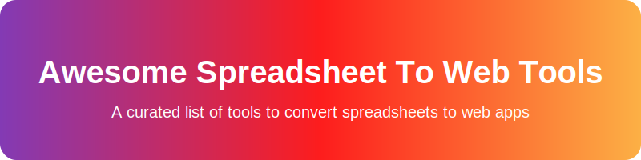

# Awesome-Spreadsheet-To-Webtools

## Top Spreadsheet to Web Tools & Converters

Convert your spreadsheets (Google Sheets, Excel, CSV, etc.) into powerful web apps, databases, portals, dashboards, and internal tools — with minimal or no coding.

This list groups **SaaS/Hosted** platforms and **Open-Source / Self-Hosted** alternatives, with **strong emphasis on open-source solutions**.

## SaaS / Hosted Platforms

Popular commercial tools that connect directly to spreadsheets and generate web interfaces quickly.

| Product | Description | Pricing | Valuation / Size |
|---------|-------------|---------|------------------|
| **[Microsoft Power Apps](https://powerapps.microsoft.com/)** | Enterprise solution with deep Excel/SharePoint integration. | Starts at $20/user/mo. Free developer plan available (for individual testing).  $3T |
| **[AppSheet](https://about.appsheet.com/home/)** | Powerful no-code apps directly from spreadsheets with strong mobile support. | Starts at $5/user/mo. Free tier available (for prototyping, up to 10 users).  $2T |
| **[Bubble](https://bubble.io/)** | Full visual web application builder with excellent data integration. | Starts at $32/mo. Free tier available (watermarked, basic features, community support).  $500M |
| **[Softr](https://softr.io/)** | Beautiful client portals, directories, and web apps from Airtable/Google Sheets. | Starts at $49/mo. Free tier available (up to 5 internal or 100 external users).  $100M |
| **[Glide](https://www.glideapps.com/)** | Turns Google Sheets into mobile-first web & native apps (excellent for PWAs). | Starts at $25/mo. Free tier available (up to 3 apps, limited data/updates).  $50M |
| **[Stacker](https://www.stackerhq.com/)** | Transforms spreadsheets/Airtable into business apps and customer portals. | Starts at $59/mo. No free tier (30-day free trial available).  $20M |
| **[Adalo](https://www.adalo.com/)** | Mobile app builder with spreadsheet/database integration. | Starts at $45/mo. Free tier available (limited records and features, Adalo branding).  $20M |
| **[Noloco](https://noloco.io/)** | No-code web apps and member portals from spreadsheets. | Starts at $39/mo. No free tier (free trial available).  $5M |
| **[SpreadSimple](https://spreadsimple.com/)** | Simple websites and apps from Google Sheets/Excel. | Starts at $13/mo. Free tier available (basic features, SpreadSimple branding).  $2M |
| **[Clappia](https://clappia.com/)** | No-code apps with workflows from spreadsheets. | Starts at $5/user/mo. Free tier available (limited apps, users, and records).  $1M |
| **[SpreadsheetWeb](https://www.spreadsheetweb.com/)** | Converts Excel models into web apps and calculators. | Starts at $25/mo. No free tier (14-day free trial available).  $1M |
| **[Appizy](https://www.appizy.com/)** | Excel spreadsheets → interactive web applications. | Starts at €10/mo. Free tier available (basic converter, limited features).  $1M |

## Open-Source & Self-Hosted Alternatives (Primary Focus)

Free, self-hostable solutions that give you full control over your data and infrastructure. Perfect for privacy, customization, and avoiding vendor lock-in.

- **[NocoDB](https://github.com/nocodb/nocodb)**  — The most popular open-source **Airtable alternative**. Turn any SQL database into a spreadsheet-like interface with multiple views (Grid, Kanban, Gallery, Calendar, Form), REST/GraphQL APIs, and automations. Import spreadsheets easily.  
- **[Appsmith](https://github.com/appsmithorg/appsmith)**  — Build custom dashboards, admin panels, and CRUD apps with JavaScript extensibility. Great for internal tools.  
- **[ToolJet](https://github.com/ToolJet/ToolJet)**  — Low-code platform for building internal tools and dashboards with extensive data connectors and code flexibility.  
- **[Budibase](https://github.com/budibase/budibase)**  — Build internal tools, dashboards, forms, approval apps, and automations. Connects to spreadsheets/databases. Drag-and-drop UI.  
- **[Teable](https://github.com/teableio/teable)**  — Modern spreadsheet-database.  
- **[NocoBase](https://github.com/nocobase/nocobase)**  — Highly extensible no-code platform.  
- **[Grist](https://github.com/gristlabs/grist-core)**  — Relational spreadsheet-database hybrid with powerful formulas (including Python), charts, and sharing. Excellent for complex data logic. Self-hostable with SQLite support.  
- **[Baserow](https://github.com/bramw/baserow)**  — Open-source no-code database and application builder. Import spreadsheets, build custom apps, and use templates.  
- **[Rowy](https://github.com/buildship-ai/rowy)**  — Airtable-like spreadsheet UI with low-code backend functions (JS/TS) on Firebase/Google Cloud.  
- **[Saltcorn](https://github.com/saltcorn/saltcorn)**  — Self-hosted no-code application builder.  
## Quick Comparison (Open-Source)

| Tool        | Spreadsheet Import | App/UI Building | Self-Hosting     | Best For                     | License   |
|-------------|--------------------|-----------------|------------------|------------------------------|-----------|
| NocoDB     | Excellent         | Good           | Docker / K8s    | Airtable-like + APIs        | AGPL/OSS |
| Baserow    | Excellent         | Strong         | Yes             | No-code apps & templates    | MIT      |
| Grist      | Excellent         | Good           | Yes             | Complex formulas & data     | Apache   |
| Budibase   | Good              | Excellent      | Yes             | Internal tools & workflows  | GPL      |
| Appsmith   | Good              | Excellent      | Yes             | Dashboards & admin panels   | Apache   |
| ToolJet    | Good              | Excellent      | Yes             | Enterprise internal tools   | AGPL     |

## Why Go Open-Source?

- Full data ownership and privacy
- No per-seat pricing or row limits on self-hosted instances
- Highly customizable and extensible
- Cost-effective at any scale (only infrastructure cost)
- Easy data export and no vendor lock-in

## Getting Started

1. **Quick start with spreadsheets** → Try **NocoDB** or **Baserow**
2. **Advanced formulas & relational data** → **Grist**
3. **Rich web apps & dashboards** → **Budibase**, **Appsmith**, or **ToolJet**

Most projects offer one-click Docker deployment.

## Contributing

This list is community-driven. Feel free to open a PR to add new tools, update information, or improve comparisons!

---

**Focus**: Open-source freedom, self-hosting, and turning spreadsheet data into real web tools.
